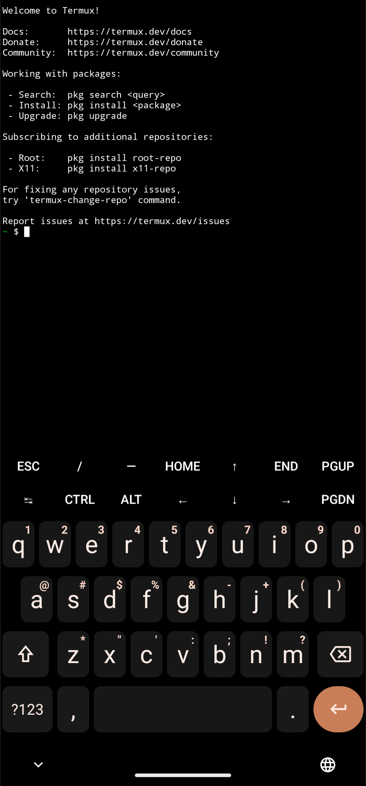
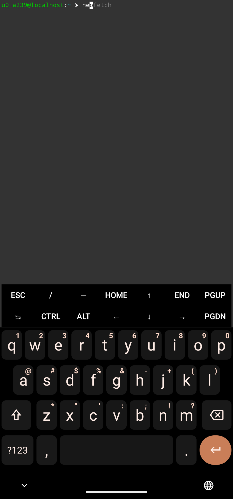

# Termify 🖥️✨  
**One-Click Terminal Setup & Theme Manager**  

Transform your terminal into a powerful environment with pre-configured tools and aliases.  
Works on **Termux (Android)** and **Linux** (Ubuntu, Arch, Fedora).  

  
  

<div align="center" style="display: flex; justify-content: space-around; align-items: center; flex-wrap: wrap; gap: 20px; margin: 30px 0;">
  
  
</div>

## 🌟 Before & After  
<div style="display: flex; justify-content: center; gap: 15px; flex-wrap: wrap; margin: 20px 0;">
  
  
</div>

## ✨ Features  
- 🛠️ **Automated Setup**  
  Installs Zsh, Oh-My-Zsh, speedtest tools, and neofetch.  
- 🔌 **Smart Configuration**  
  Auto-detects Termux/Linux environments.  
- ⚡ **Productivity Aliases**  
  `spd` - Run speed test | `neo` - Show system info | `edit` - Edit config.  
- 🔄 **Safe Rollback**  
  Use `restore-default` to revert changes (backups preserved).  

## 🚀 Quick Start  

### Install Theme 
```bash  
# Install & Setup  

git clone https://github.com/r0users/Termify.git  
cd Termify

bash install-theme

# Or

sudo ./install-theme 

# After setup completes:  

chsh -s zsh 

exit 

# Reopen Terminal
```

🛠️ Customization
Adding Themes (Advanced)

- Place your theme files in Termify/ directory.
- Modify install-theme.sh to apply your theme.

## Restore Defaults
```bash

cd Termify

bash restore-default.sh

# Or

sudo ./restore-default.sh

exit  

# Reopen Terminal
```

## ❓ FAQ
### "Why doesn't my shell change automatically?"

- Changing shells requires elevated privileges.
- Follow the post-install instructions carefully.

### "Package installation failed!"

- Ensure you have internet connection.
- For Linux, run with sudo.